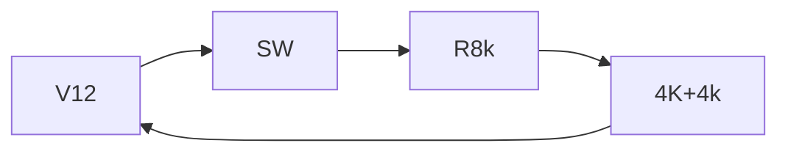
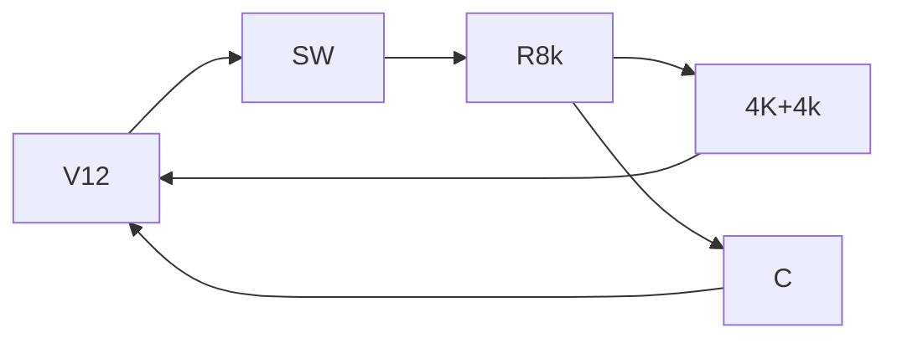

# Digital-core-Technologies

This relates to  this hackethon

### Place

- [ ] Complete this

## Questions

The interview has done in 3 section , 1 section was a online section , which gives some exercise to do

## Circuit analysis

There are 3 conditions to be ana

### RL Cicruits

What do they expect?

- make capacitor as short circuit when the switch is turned on ^[The reason beeing , the sudden change in voltage has occupies almost entire frequency spectrum or in electronics sudden change is considerd as high freq]
-

### Transistor Circuits

